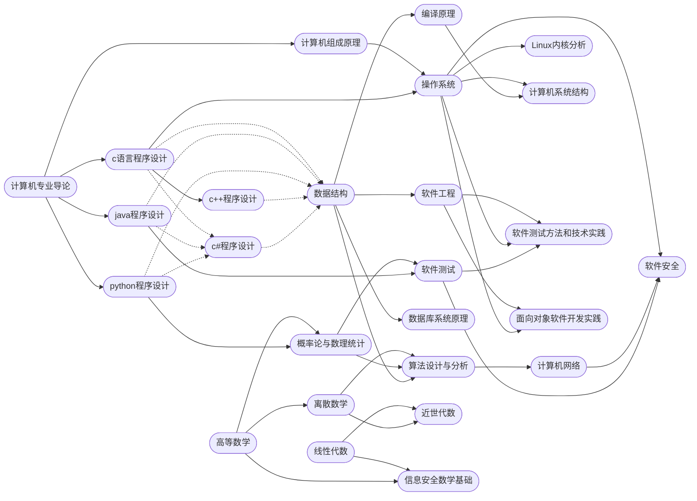

```mermaid
graph LR;
id1([计算机专业导论]) --> id3([c语言程序设计])
id1 --> id4([java程序设计])
id1 --> id5([python程序设计])

id2([高等数学]) --> id6([离散数学])
id2 --> id7([概率论与数理统计])
id3 --> id8([c++程序设计])
id1 --> id9([计算机组成原理])
id5 --> id7
id3 -.-> id10([数据结构])
id4 -.-> id10
id5 -.-> id10
id8 -.-> id10
id3 -.-> id11([c#程序设计])
id4 -.-> id11
id5 -.-> id11
id11 -.-> id10
id6 --> id12([算法设计与分析])
id7 --> id12
id10 --> id12

id10 --> id13([软件工程])
id9 --> id14([操作系统])
id3 --> id14
id10 --> id15([编译原理])
id12 --> id16([计算机网络])
id10 --> id17([数据库系统原理])
id7 --> id18([软件测试])
id4 --> id18

id19([线性代数]) --> id20([近世代数])
id6 --> id20
id14 --> id21([Linux内核分析])
id14 --> id22([计算机系统结构])
id15 --> id22
id19 --> id23([信息安全数学基础])
id2 --> id23
id14 --> id24([软件安全])
id16 --> id24
id18 --> id24
id13 --> id25([软件测试方法和技术实践])
id14 --> id25
id18 --> id25
id13 --> id26([面向对象软件开发实践])
id14 --> id26
```